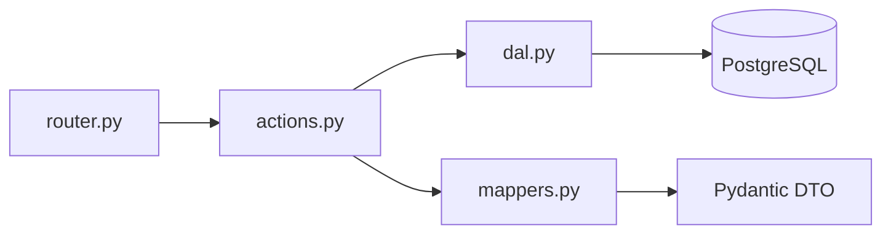

# Слой роутеров (обязательная структура)

**Источник истины:** этот файл — канон для новых эндпоинтов и ревью PR в `auth-service`. Отклонения только с явным решением команды (ADR / зафиксированное исключение в issue).

**Связанный трекинг:** [#32](https://github.com/ZhuchkaTriplesix/ZhuchkaKeyboards_auth/issues/32) — чеклист для ревью PR и ссылки на монорепо.

---

## Незыблемые правила (зарубить на носу)

1. **`router.py`** — только HTTP: маршруты, `Depends`, коды ответов, перевод доменных исключений в `HTTPException`. **Никакого** SQL и бизнес-правил.
2. **`schemas.py`** — единственное место контрактов JSON (запрос/ответ) для OpenAPI.
3. **`actions.py`** — оркестрация и правила домена; вызывает **`dal`**; не тащит FastAPI `Request`/`Response` вглубь логики.
4. **`dal.py`** — только доступ к БД (SQLAlchemy и т.п.); без HTTP-семантики и правил продукта.
5. **Успешные ответы** — наружу **только Pydantic-DTO**, не ORM-объекты; маппинг ORM → DTO в `actions` или в **`mappers.py`**.
6. **Ошибки** — единый **envelope** `ApiErrorResponse` (`code`, `message`, опционально `details`, `request_id`); см. `src/api/error_schemas.py` и `src/api/error_handlers.py`. Не собирать «свой» JSON ошибки в обход обработчиков без причины.
7. **OpenAPI** — у эндпоинтов в `router.py` задаются **`summary`** и **`description`** (и при необходимости `responses`).

Сквозные требования ко всем микросервисам монорепозитория (в т.ч. формат ошибок): [`docs/microservices-api-requirements.md`](https://github.com/ZhuchkaTriplesix/ZhuchkaKeyboards/blob/main/docs/microservices-api-requirements.md) (§1.4 «Ошибки»).

---

## Структура каталога

Для каждого доменного роутера в `src/routers/<name>/` придерживаемся одной схемы (эталон: `routers/root/`).

| Файл | Назначение |
|------|------------|
| `router.py` | Только HTTP: маршруты, `Depends`, коды ответов, вызов `actions`, маппинг исключений → `HTTPException`. Без SQL и бизнес-правил. |
| `schemas.py` | Pydantic-модели запросов/ответов и DTO для OpenAPI. |
| `actions.py` | Бизнес-логика: оркестрация, вызовы `dal`, хеширование паролей/секретов, правила домена. |
| `dal.py` | Только доступ к БД: SQLAlchemy-запросы, без HTTP и без правил продукта. |
| `enums.py` | Перечисления домена (по необходимости). |
| `mappers.py` | По необходимости: ORM → DTO, чтобы не раздувать `actions`. |

**Ответы и ошибки (REST):**

- Успешные тела — **только Pydantic-схемы** (DTO), не ORM-объекты; маппинг ORM → схема в `actions` или отдельных `mappers.py`.
- Коды HTTP по смыслу (`201` создание, `204` без тела, `400/401/403/404/409/422` и т.д.).
- Ошибки — единый **envelope** `ApiErrorResponse` (`code`, `message`, опционально `details`, `request_id`), см. `src/api/error_schemas.py` и глобальные обработчики в `src/api/error_handlers.py`.

Дополнительно:

- У эндпоинтов в `router.py` задаются **`summary`** и **`description`** (и при необходимости `responses`) для OpenAPI.
- Исключения домена (например «не найдено») лучше поднимать из `actions` и переводить в HTTP в `router.py`.

Исторически OAuth и часть admin росли в одном файле / в `src/auth/oauth_logic.py` — такой код постепенно переносим в эту структуру по модулям.
